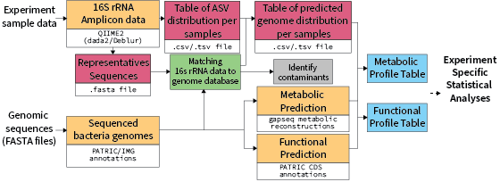

# BiomProfiler 

!!! warning "Disclaimer""
  
    It is important for you to understand that this tool was designed to work for experiments where synthetic communities of sequenced strains were used.
    The tool can't guess what a microbe you got from the wild will look like, even if it has very close or identitcal 16S rRNA sequence. The strains could still carry significant differences that would altere you interpretation of the expriment.

## Concept

To predict defined community functional profiles, we build Biomprofiler, a bioinformatic pipeline that converts 16S rRNA amplicon-based community composition to a gene abundance profile. The ASV table prediction and reference sequence fasta file, together with the experiment metadata file, are then analyzed with BiomProfiler to predict the genetic potential profile of the different microbial communities. To use this pipeline, the user needs to provide a reference community for the pipeline to look for the bacteria in the amplicon dataset. 

{ width="500" }


The BiomProfiler pipeline begins by creating a blast reference nucleotide database using a user-provided list of bacteria of the defined synthetic community used in the experiment. A nucleotide blast (Blastn) is used to query the amplicon sequence variant (ASV) sequences against the nucleotide database and return matches with a 99% minimum identity. Samples not present in the metadata file or with less than 1000 sequences were flagged and removed. Similarly, ASVs with no count were also flagged and removed. The pipeline parses the blast results and associates each ASV with specific genomes. Bacteria in the reference list with identical sequences are merged into the same "Genome unit" and processed as one. Reference bacteria with no 100% blast hits are then attributed to the closest blast result within a 99% similarity limit. If an ASV does not match any reference sequence, it is flagged as potential contamination.

The tutorial below explain how to transform a 16S rRNA amplicon project into a Genomic Potential prediction table.

## Instal the tool.

First you will need to head to the [BiomeProfiler github repository](https://github.com/aassie/BiomeProfiler) and clone the repository on your computer with

```{bash}
git clone https://github.com/aassie/BiomeProfiler
```

### Pre requierement

To use BiomeProfiler you will need to have:

- Local installation of [BLAST](https://blast.ncbi.nlm.nih.gov/doc/blast-help/downloadblastdata.html)
- [R](https://cran.r-project.org/), with the following packages:
  - [tidyverse](https://www.tidyverse.org/)
  - [vegan](https://cran.r-project.org/web/packages/vegan/)
  - [RColorBrewer](https://cran.r-project.org/web/packages/RColorBrewer)
  - [labdsv](https://cran.r-project.org/web/packages/labdsv/index.html)
  - [FSA](https://cran.r-project.org/web/packages/FSA/index.html)
  - [Bioconductor](https://bioconductor.org/)
    - [Phyloseq](https://bioconductor.org/packages/release/bioc/html/phyloseq.html)
    - [DESeq2](https://bioconductor.org/packages/release/bioc/html/DESeq2.html)
  - [composition](https://cran.r-project.org/web/packages/compositions/index.html)
- Our consensus annotation file. It is a big file, you can download it from Zenodo [here](https://zenodo.org/records/10689575). Once you have it place the file in the `Data/` folder and rename it `WB.tsv`.

## Conda

There is currently no conda package available for Biomeprofiler. But we advise you to use conda to manually create a environment to run the pipeline

###  Create the environment

```
conda create --name biomeprofiler
conda activate biomeprofiler
conda config --add channels defaults && conda config --add channels bioconda && conda config --add channels conda-forge
```

### Install the tools

```
# basic dependencies
conda install bash r perl parallel gawk sed grep bc git coreutils wget

# install blast
conda install blast

# R-package dependencies (via conda repos)
conda install r-tidyverse r-readr r-reshape2 r-vegan r-RcolorBrewer r-labdsv r-FSA r-biocmanager bioconductor-phyloseq bioconductor-deseq2 r-composition
```

## Run the Script

### The files needed to run the pipeline

#### Bacteria Collection

To run the pipeline you need to provide a file with the 16S rRNA sequences of the bacteria you used in your experiments. Once you have this fasta file, place it in the `Data/Collection` folder.

Currently there are a few example in the `Data/Collection` folder, mainly the CeMbio and BIGBiome communities.

#### ASV table

This table is your standard output of a 16S rRNA pipeline, such as [Qiime2](https://qiime2.org/), Mothur(https://mothur.org/) or directly from [Deblur](https://github.com/biocore/deblur) or [DaDa2](https://benjjneb.github.io/dada2/)

At the moment the Sample ID column needs to be named `X.SampleID`. I am working on making it smarter.

#### Representative ASV file

This is a fasta file with the representative sequences for the ASV name used in the ASV table above. It should be an output from your 16S rRNA pipeline.

#### Metadata

This file should be a a tab delimited file with all the information relevant to your experiment. 
The column with the sample name matching the ASV count table should be called `X.SampleID`.

You can also add a column that you can use to group and color the sample in the different figures generated by the script. 
This column name can be passed with the `-s1` option and figures can be generated with the stat mode enabled with the `-st` option.

### Main run command

When you have all the required information a typical biomeprofiler run should look like the command below.

```
~/Your/Path/biomeprofiler.sh -a ASV.table.tsv -m metadata.txt -s ASV.sequences.fasta -b BacteriaCollectionName -o Output_Folder -s1 TestGroup -v -st
```

`BacteriaCollectionName` correspond to the name of the Bacteria Collection file you create or use (see above)

### Script output
In the folder where you ran the script you should now see a folder named after your `Output_folder` name.

The main output from the script is the `Pangene.profile.table.csv` file which can be used for further downstream analysis.

In the folder should be the following files:

```{bash}
Output_folder/
├─ ASV.genome.png
├─ ASV.png
├─ Blast.Result.txt
├─ Figure1.png
├─ log/
│  ├─ ASV.0.count.txt
│  ├─ ASV.not.mapping.to.genome
│  ├─ Genome.not.present.in.database.txt
│  ├─ Sample.No.Data.txt
│  ├─ Sample.No.Metadata.txt
├─ NEW.ASV.to.Genome.table.csv
├─ PanGen.pcoa.png
├─ Pangene.profile.table.csv
├─ PCOA.ASV.results.png
├─ PCOA.Genome.results.png
├─ WormBiome_Report.nb
```

The table below provide a description of each file

??? information "File description"

    | File Name.                        | Description                                                                   |
    |-----------------------------------|-------------------------------------------------------------------------------|
    |ASV.genome.png                     | Genome abundance accross sample in stacked barplot                            |
    |ASV.png                            | ASV abundance accross sample in stacked barplot plot                          |
    |Blast.Result.txt                   | Blast result file                                                             |
    |log/                               | Folder with Log files from the Wormbiome script                               |
    |ASV.0.count.txt                    | ASV with 0 counts (Usually this happens when you provide a sliced data)       |
    |ASV.not.mapping.to.genome          | List of ASV sequence not matching the provided reference list                 |
    |Genome.not.present.in.database.txt | Which genome are not present in the provided database                         |
    |Sample.No.Data.txt                 | Which sample had no                                                           |
    |Sample.No.Metadata.txt             | Which sample were missing Metadata                                            |
    |Genome.table.csv                   | Genome abundance table - ASV to genome converted                              |
    |Pangene.profile.table.csv          | MAIN OUTPUT: Gene profile prediction table                                    |
    |PCOA.ASV.results.png               | PCOA plot calculated with the ASV table                                       |
    |PCOA.Genome.results.png            | PCOA plot calculated with the genome table                                    |
    |PCOA.PanGen.png                    | PCOA plot calculated with the gene profile table                              |
    |Report.Figure1.png                 | Figure generated for the report                                               |
    |WormBiome_Report.nb                | Report summarizing the wormbiome run                                          |

### Script options description

Below is detailed explanation of what each option stands for

```
Options:
   -h|--help               Display this help

   -a|--ASVtable           Required. Biom/tsv/csv File

   -m|--ASVmeta            Required. Count table related Metadata

   -s|--ASVsequence        Required. related ASV sequences

   -b|--BacteriaList       Required. Collection Name or list of bacteria
                           name used in the experiment. One per line

   -w|--wbdb               Required. Path to WormBiome genome database

   -o|--OutFolder          Output folder
                           Default: ./OUT/

   -s1|--Selector1         Name of column to use as category used
                           for graph plot categorisation and basic
                           statistics

   -t|--TableType          Input table type (BIOM/TSV/CSV)

   -c|--CountThreshold     Minimum read count threshold for samples
                           Default: 1000
   
   -p|--pandoc             Pandoc path if it is not installed in common place

   -v|--Verbose            Verbose mode. Provide a lot of details.

   -st|--Stats             Perform statistical analysis using the s1 column option
```

## Downstream Analysis

### Understanding the Pangene profile table

The Pangene profile table provide a pangene count per sample table. The table should look like the example below:

|           |Sample 1|Sample 2|Sample 3|
|-----------|--------|--------|--------|
|GC_00000001|1000    |520     | 1      |
|GC_00000005|100     |1000    | 100    |

We perform a global pangenome analysis on Wormbiome database which allow us to group gene with similar sequences into the same annotation group.
Each annotation carries it's own set of more specialized annotations such as KEGG, COG, CAZy and more.


### Converting Gene cluster to functional profiles

The pangenome table can then be transformed into a functional table (KEGG, COG, CAZy).
We provide a specialized, `table.transform.R` script to do exactly that. 

You can run the script has follow:

```{bash}
Rscript table.transform.R -i Pangene.profile.table.csv -o OUT_FILE -f FUNCTION_TO_CONVERT -h
```

Command details:

- `Pangene.profile.table.csv` should be the file generated by the `Biomeprofiler.sh` script
- `OUT_FILE` name for the output file
- `FUNCTION_TO_CONVERT` name of the column from the WormBiome database to use. (See below)
- `-h` option add the hierarchical categories associated with the KEGG annnotations (See below)

You can use any column for the WormBiome consensus table but we recommend the following ones:

| Column name             | Description                                                                                     |
|-------------------------|-------------------------------------------------------------------------------------------------|
| Bakta_Cazy              | Custom [CAZy](https://www.cazy.org/) annotation based on Bakta gene calling.                    |
| Bakta_COG               | Cluster of Orthologous Groups (COG) annotation from Bakta                                       |
| Bakta_EC                | Enzyme Commission (EC) number annotations                                                       |
| Bakta_GO                | Gene Ontology (GO) annotations                                                                  |
| Bakta_KO                | Custom KEGG Orthology (KO) annotation based on Bakta gene calling                               |
| Bakta_PFAM              | Protein family (PFAM) annotation                                                                |

!!! warning "Dealing with Multiple annotations"

    Some genes carry multiple annotations. The KEGG annotations typically overlap accross function and enzymatic description. In this case the gene annotation will count for each annotations. 
    For example, if a pangene is present 10 time in a sample and is annotated both with K0001 and K0002 it will add 10 count to both K0001 and K0002

### KEGG extra annotations

We also provide a hierarchical organisation of the Kegg annotations that you can find [here](https://github.com/aassie/BiomeProfiler/blob/main/Data/Kegg.metadata.tsv).
You can add the `-h` option to the `table.transform.R` script to have the categorie appened to the table.

!!! warning "Warning"

    It is important to know that KEGG annotations can belong to multiple KEGG categories. This will duplicated many row in your table so handle your data accordingly if you want to perform further downstream analyses.


## Known issue

### Pandoc library missing

The last step of the script generates a little hmtl summary of the pipeline. Sometimes if your computer or environment is doesn't have the right latex library you might have an error message that looks like this:

```{bash}
Error: pandoc version 1.12.3 or higher is required and was not found (see the help page ?rmarkdown::pandoc_available).
```

There are no simple way to go around this. First you need to check if you R installation has access to a pandoc library.
In R try:

If you get a 0 back you can try to install pandoc in your conda environment with:

```{bash}
conda install conda-forge::pandoc
```

The copy paste the pandoc path you get from the command below:
```{bash}
which pandoc
```

And pass this path with the `-p` option of the script.