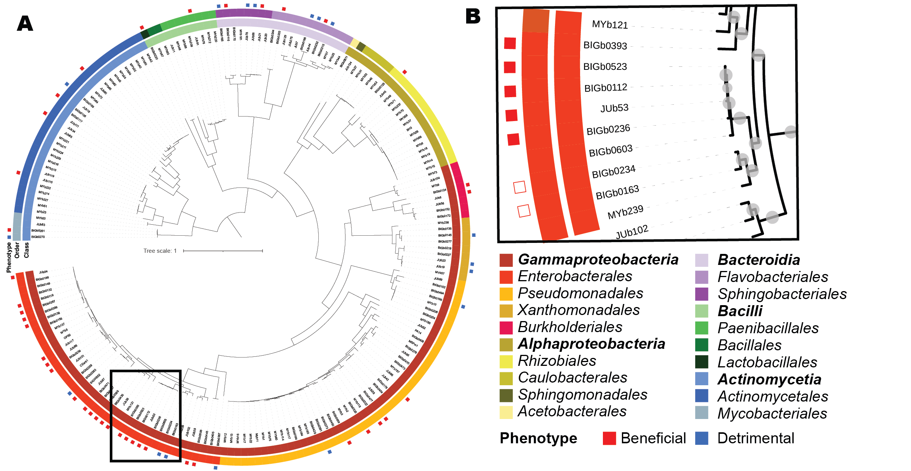
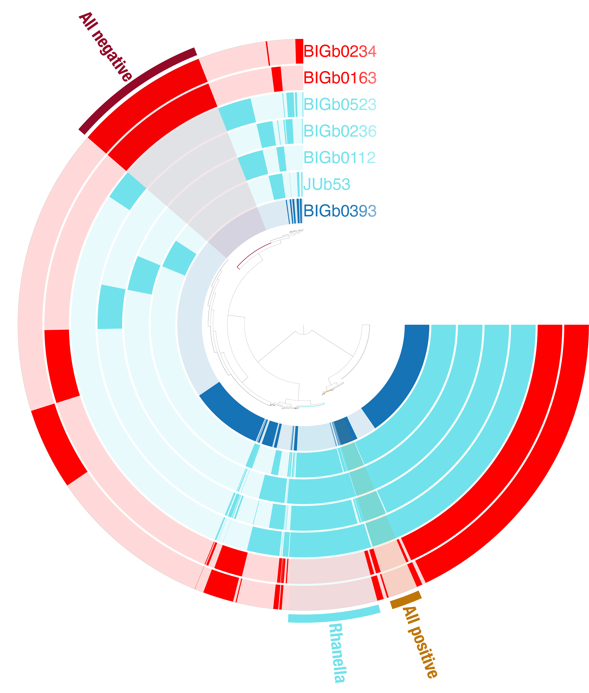
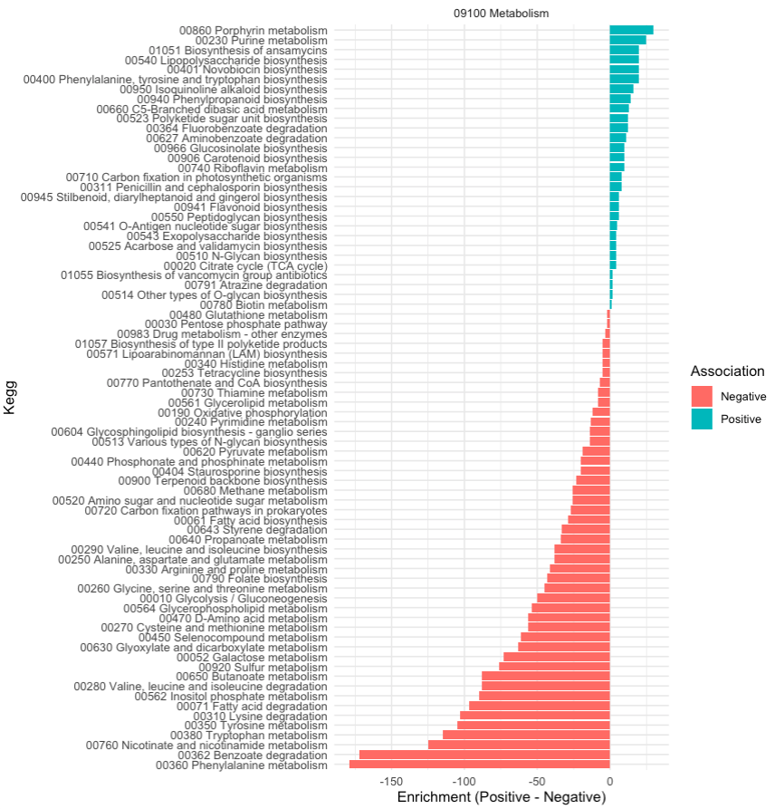
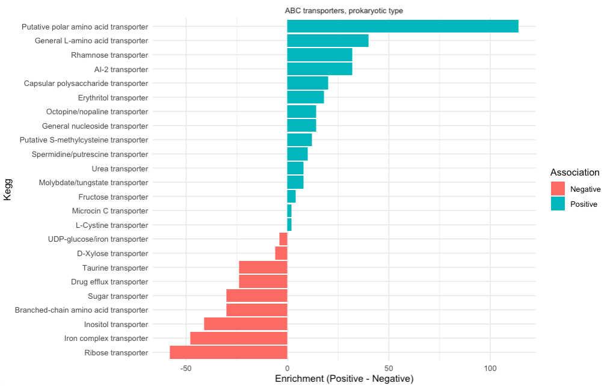

# Metagenomic comparisons

This tutorial covers a pangenomic approach to compare closely related genomes you are interested in. The code below explain how to compre closely related *Enterobacteriaceae* genomes that have different phenotype when fed to *C. elegans*
This approach is based on the An open-source, community-driven analysis and visualization platform for microbial 'omics or [Anvio](https://anvio.org/).
Anvio is a very comprehensive pipeline with many modules that can perform metagenomic reconstruction and pangenomic analyses. 

## Before running

!!! info "Using third party tools"

    There is no need to reinvent the wheel, the official Anvio tutorial [here](https://merenlab.org/2016/11/08/pangenomics-v2/) and [here](https://merenlab.org/2018/12/01/combining-annotation-sources-for-pan/) as well as the work from [Mike Lee](https://anvio.org/people/AstrobioMike/) are excellent and detailed resources on how to perform this type of pangenomic comparison. Check the link for step by step general tutorials.

### Installing softwares

Head to this [page](https://anvio.org/install/) for anvio installation guide.

And we'll need a side set of script from [Mike Lee](https://merenlab.org/2018/12/01/combining-annotation-sources-for-pan/):

You can install it with the code below

```{shell}
conda create -y -n bit -c conda-forge -c bioconda -c defaults -c astrobiomike bit
```

## Case study for this tutorial

A previous study, [Samuel et al, 2016]() investigated how different bacteria isolated from *C. elegans* would affect the nematode's fitness. The authors group the bacteria in a beneficial and detrimental groups. We have now sequenced several of the strains used in the original manuscript and we can plot how beneficial and detrimental phenotype are distributed accross different taxonomies. 


///caption
**A.** Phylogenomic reconstruction of the taxonomic relationship between the bacteria present in the WormBiome database (at the time of first publication).**B.** Close up on the genomes used in this tutorial
///

Among those phenotypes we compared the genomes of seven closely related bacteria that are cluster in a beneficial and detrimental phenotypes. Our genome comparison includes two detrimental *Serratia*, four beneficial *Rahnella*, and one beneficial *Pantoea*. The latter was selected as a positive outgroup to reduce the noise signal due to all the genomes being closely related and identifying genes specifically associated with the beneficial potential of the *Rhanella*.


## Preparing run

To run the Anvio pipeline we need to get our file in the right place and format.

We run the Pangenomic analysis with our Bakta annotated genomes, you can use any format you want as long as it is in a GeneBank format.

First we list the genome names in a `Gene.list.txt` file

The genomes used for our example:

```{text}
BIGb0112
BIGb0163
BIGb0234
BIGb0236
BIGb0393
BIGb0523
JUb53
```

The GeneBank files generated by Bakta are not compatible with the default Anvio pipeline and we need to hack our way in. Thankfully, Mike Lee did all the job for us with his `bit` environment.

All Bakta gbk file are copied in the `GBK` folder and we create a `clean` folder for having the genbank corrected files stored in.

```{shell}
for i in $(cat Gene.list.txt);
    do cp /PATH/$i GBK/;
done
mkdir clean
```

In brief the script rename Bakta genbank contig name to unique contig per genomes

```{shell}
conda activate bit
for i in $(ls -d GBK/*);
  do a=$(echo $i | cut -f2 -d"/" |gsed "s/gbff\///g; s/\.gbff//g");
  echo $i $a;
  bit-genbank-locus-clean-slate -i $i -o clean/$a.gbk -w $a;
done
cat clean/*gbk> all_refs.gbff
conda deactivate
```
The file are now ready for post processing

## Running Anvio

We are going use the Pangenomic analysis pipeline. We are providing a quick overview of the pipeline below, for more detailled information consult the [Anvio tutorial](https://merenlab.org/2016/11/08/pangenomics-v2/).

The command below run essential Anvio command to get the file in a Anvio-specific format which will allow the pangenomic comparison.

```{shell}
conda activate anvio-8
```
Import all the information we have from our genbank files into compatible file format

```{shell}
anvi-script-process-genbank -i all_refs.gbff --output-gene-calls all_refs_gene_calls.tsv --output-functions all_refs_functions.tsv --output-fasta all_refs.fa --include-locus-tags-as-functions
```
Create a contig database, with all the gene call information
```{shell}
anvi-gen-contigs-database -f all_refs.fa -o contigs.db -n Wormbiome --external-gene-calls all_refs_gene_calls.tsv  --split-length -1 --num-threads 12
anvi-import-functions -c contigs.db -i all_refs_functions.tsv
```
Look for unique copy marker genes:
```
anvi-run-hmms -c contigs.db --num-threads 12
```

Create a collection file
```{bash}
cd clean
for genome in $(ls *gbk | cut -f1 -d ".");
  do   grep "LOCUS" "$genome".gbk | tr -s " " "\t" | cut -f2 > "$genome"_contigs.tmp;
    for contig in $(cat "$genome"_contigs.tmp);
       do     echo "$genome";
     done > "$genome"_name.tmp;
   paste "$genome"_contigs.tmp "$genome"_name.tmp > "$genome"_for_cat.tmp;
done
cat *_for_cat.tmp > collection.tsv && rm *.tmp
cd ..
mv  clean/collection.tsv ./
anvi-profile -c contigs.db -o profile -S profile --blank-profile --min-contig-length 0 --skip-hierarchical-clustering
anvi-import-collection collection.tsv -c contigs.db -p profile/PROFILE.db -C Wormbiome --contigs-mode
```
Get the genome database and file ready:
```{bash}
echo -e "name\tbin_id\tcollection_id\tprofile_db_path\tcontigs_db_path" > header.tmp

cut -f2 collection.tsv | uniq > name_and_bin_id.tmp
for i in $(cat name_and_bin_id.tmp); do echo "Wormbiome"; done > collection_id.tmp
for i in $(cat name_and_bin_id.tmp); do echo "$PWD/profile/PROFILE.db"; done > profile_db_path.tmp
for i in $(cat name_and_bin_id.tmp); do echo "$PWD/contigs.db"; done > contigs_db_path.tmp
paste name_and_bin_id.tmp name_and_bin_id.tmp collection_id.tmp profile_db_path.tmp contigs_db_path.tmp > body.tmp
cat header.tmp body.tmp > internal_genomes.tsv && rm *.tmp

anvi-gen-genomes-storage -i internal_genomes.tsv -o wormbiome-GENOMES.db --gene-caller NCBI_PGAP

```

Finally run the pangenome comparison
```{bash}
anvi-pan-genome -g wormbiome-GENOMES.db \
               -n wormbiome-mcl \
               --num-threads 12 --mcl-inflation 10 
```
At this point you are done with the pangenomic workflow. 

### Interactive option
Anvio comes with a visualization tool which allow you to browse the pangenomic results you just generated.

If you are running Anvio on personal computer (And not an HPC or cloud server) you can open the visualization in your browser with the following command:

```{bash}
anvi-display-pan -p wormbiome-mcl/wormbiome-mcl-PAN.db -g wormbiome-GENOMES.db
```

The interactive window opens in an internet browser and allows you to inspect the different genetic bloc identified by Anvio and their distribution accross the genomes you used.

You can generate the project overview below:



### Exporting tables

Beyond the visualization you can also extract the raw data to perform downstream analysis.

```{bash}
anvi-script-add-default-collection -c contigs.db -p wormbiome-mcl/wormbiome-mcl-PAN.db -C Wormbiome
#Export gene clusters
anvi-summarize -p wormbiome-mcl/wormbiome-mcl-PAN.db -g wormbiome-GENOMES.db -C Wormbiome -o Project_summary
#Export gene names
anvi-export-gene-calls -c contigs.db --gene-caller NCBI_PGAP -o gene_call.txt --skip-sequence-reporting
```

This generate a new folder called `Project_bins` with a gzipped folder called `wormbiome-mcl_gene_clusters_summary.txt.gz`.
This archived table contain the gene and their pangene cluster distribution.

It should look like:

| unique_id | gene_cluster_id | bin_name | genome_name | gene_callers_id | num_genomes_gene_cluster_has_hits | num_genes_in_gene_cluster | max_num_paralogs | SCG | functional_homogeneity_index | geometric_homogeneity_index | combined_homogeneity_index | NCBI_PGAP_ACC         | NCBI_PGAP                               | GENBANK_LOCUS_TAG_ACC | GENBANK_LOCUS_TAG | aa_sequence  |
|-----------|-----------------|----------|-------------|-----------------|-----------------------------------|---------------------------|------------------|-----|-------------------------------|----------------------------|---------------------------|-----------------------|------------------------------------------|-----------------------|-------------------|--------------|
| 1         | GC_00000001     |          | BIGb0112    | 2578           | 7                                 | 41                        | 9                | 0   | 0.71672568                   | 0.801079555                | 0.756558582               | gnl|Bakta|GLGILE_13165 | Outer membrane porin OmpC/OmpF/PhoE (ompC) | GLGILE_13165         | GLGILE_13165      | BIG_SEQUENCE |


The table list all genes used in the analysis, their associated genome and gene cluster.
You also have some useful metrics such as how many genes are in the gene cluster and how many genome have hit in the gene cluster.

## Downstream analysis

In the original WormBiome manuscript we used the anvio export table to generate a simple function associated to gene cluster abundance between Beneficial and Detrimental bacteria.

First prepare the environment and loading the data you'll need

```{R}
library(tidyverse)

df<-read_tsv("~/Documents/02_Work/BCM/2024/Wormbiome/Figures/Figure6 - Pangenomics/PanEntero/Project_bins/wormbiome-mcl_gene_clusters_summary.txt")
kometa<-read_csv("~/Documents/02_Work/github/Kegg.hierachy/Ko.hierarchy.csv")
WB<-read_tsv("~/Documents/02_Work/BCM/2024/Wormbiome/Other/WB.tsv") 
```

Transform the data into something usable
```{R}
d2=df %>% 
  group_by(genome_name) %>%
  mutate(totgene=n()) %>%
  ungroup() %>% 
  mutate(cat=ifelse(genome_name %in% c("BIGb0234","BIGb0163"), "Negative","Positive"),
         cat2=ifelse(genome_name %in% c("BIGb0234","BIGb0163"), -5,2)) %>% 
  select(genome_name,
         gene_cluster_id,
         NCBI_PGAP_ACC,
         cat,
         cat2) %>% 
  mutate(Bakta_ID=gsub("^.*\\|","",NCBI_PGAP_ACC)) %>% 
  left_join(WBKO %>% select(!gene_cluster_id)) %>%
  select(!NCBI_PGAP_ACC) %>%
  group_by(gene_cluster_id,Bakta_PredKO) %>% 
  summarise(n=sum(cat2))
```

Then we create two new objects that contains the KEGG annotations that are unique to either the Beneficial or Detrimental bacterial genomes.
```{R}
d2.nonunique.D = d2 %>% 
  rename(KO=Bakta_PredKO) %>% 
  left_join(kometa) %>% 
  mutate(cat=ifelse(n<0,"Negative","Positive"),
         n=abs(n)) %>% 
  group_by(cat,D) %>% 
  summarise(n=sum(n)) %>% 
  ungroup() %>% 
  group_by(D) %>% 
  mutate(Unique=ifelse(n()==2,"No","Yes")) %>%
  filter(Unique=="No") %>% 
  ungroup() 

d2.unique.D = d2 %>% 
  rename(KO=Bakta_PredKO) %>% 
  left_join(kometa) %>% 
  mutate(Association=ifelse(n<0,"Negative","Positive")) %>% 
  group_by(Association,D) %>% 
  summarise(diff=sum(n)) %>% 
  ungroup() %>% 
  group_by(D) %>% 
  mutate(Unique=ifelse(n()==2,"No","Yes")) %>%
  filter(Unique=="Yes") %>% 
  ungroup()
```

We do a Wilcox test to identify which KEGG annotations are significant enriched in either phenotype category

```{R}
d2.d.test=d2 %>% 
  rename(KO=Bakta_PredKO) %>% 
  left_join(kometa) %>% 
  mutate(cat=ifelse(n<0,"Negative","Positive"),
         n=abs(n)) %>% 
  group_by(gene_cluster_id,cat,D) %>% 
  summarise(n=sum(n)) %>% 
  ungroup() %>% 
  filter(D %in% unique(d2.nonunique.D$D)) %>% 
  group_by(D) %>%
  summarise(
    p_value = wilcox.test(n ~ cat, data = cur_data())$p.value
  ) %>%
  mutate(
    padj=p.adjust(p_value, method = "BH"),
    significance = p.adjust(p_value, method = "BH") < 0.05  # Adjust p-values (e.g., FDR correction)
  ) %>% 
  filter(significance==TRUE)
```

We also calculate the enrichment of the different KEGG annotations in each phenotype categories to identify the highly enriched ones.

```{R}
enrichment <- d2 %>%
  rename(KO=Bakta_PredKO) %>% 
  left_join(kometa) %>% mutate(cat=ifelse(n<0,"Negative","Positive"),
                               n=abs(n)) %>% 
  group_by(gene_cluster_id,cat,D) %>% 
  summarise(n=sum(n)) %>% 
  ungroup() %>% 
  group_by(D, cat) %>%
  summarise(median_n = sum(n), .groups = "drop") %>%
  pivot_wider(names_from = cat, values_from = median_n, names_prefix = "median_") %>%
  mutate(
    diff = median_Positive - median_Negative  # Enrichment difference
  )

final_results <- left_join(d2.d.test, enrichment, by = "D") %>% 
  filter(!is.na(D)) %>% 
  filter(significance == TRUE) %>%
  mutate(Association=ifelse(diff < 0, "Negative","Positive"),
         type="Stat") %>% 
  add_row(d2.unique.D %>% 
            select(!c(Unique)) %>% 
            mutate(type="Unique")) %>% 
  arrange(desc(abs(diff))) %>%
  filter(diff!=0) %>% 
  left_join(kometa %>% select(!KO) %>% unique())
```

This analysis returns a lot of information that can be difficult to visualize all a once.

Fortunately with our KEGG hierarchical categories we examine one category at the time, starting with metabolism related KEGG annotations

```{R}
final_results %>%
    filter(B=="09100 Metabolism") %>% 
    ggplot(aes(x = reorder(D, diff), y = diff, fill = Association)) +
    geom_bar(stat = "identity") +
    coord_flip() +
    labs(x = "Kegg", y = "Enrichment (Positive - Negative)") +
    facet_wrap(~B, scales = "free")+
    theme_minimal()
```




From this we can observe:

**Beneficial Phenotypes:**

Enrichment in pathways related to:
- Secondary metabolism, including antibiotic biosynthesis (e.g., vancomycin, novobiocin, staurosporine) and polyketide biosynthesis.
- Biosynthesis of glycan structures (e.g., N-glycan biosynthesis, lipopolysaccharide biosynthesis, O-antigen nucleotide sugar biosynthesis, and exopolysaccharide biosynthesis).
- Carbon fixation in photosynthetic organisms and pathways such as the glyoxylate cycle, which can contribute to metabolic versatility.
- Biosynthesis of vitamins (e.g., biotin, riboflavin, folate).
- Metabolism of unique compounds, like glucosinolates or carotenoids, suggesting potential antioxidant and host interaction benefits.

**Negative Phenotypes:**

Enrichment in pathways related to:
- Degradation of host-relevant compounds (e.g., amino acids like lysine and methionine, and fatty acid degradation).
- Central energy production (e.g., oxidative phosphorylation, glycolysis, TCA cycle), indicating resource extraction from the host.
- Sulfur metabolism and other potentially detrimental pathways tied to stress or pathogenicity.
- Degradation of aromatic compounds (e.g., benzoate, styrene), which might indicate environmental adaptability but potential host toxicity.

By digging into literature and know behavior of pathogens and symbionts we can conclude that :

Beneficial bacteria appear to specialize in biosynthesis of secondary metabolites, glycan structures, and vitamins, which could directly or indirectly support host health. For example:
Glycans and exopolysaccharides are often involved in biofilm formation, immune modulation, or protection against pathogens.
Vitamin biosynthesis can supplement the host's nutritional requirements.

Detrimental bacteria are enriched in pathways that extract energy and degrade host resources, potentially weakening the host. For example:
Fatty acid degradation and oxidative phosphorylation suggest energy extraction from the host.
Degradation of sulfur compounds or aromatic compounds might lead to toxic byproducts.

We can also examine a different KEGG category:

```{R}
final_results %>%
  filter(B=="ABC transporters, prokaryotic type") %>% 
  ggplot(aes(x = reorder(D, diff), y = diff, fill = Association)) +
  geom_bar(stat = "identity") +
  coord_flip() +
  labs(x = "Kegg", y = "Enrichment (Positive - Negative)") +
  facet_wrap(~B, scales = "free")+
  theme_minimal()
  theme(axis.text.y = element_blank())
```

Looking at the transporter and we can see that Beneficial genomes are enriched in amino-acid transporters and the Detrimental one are enriched in Iron transporters. Stealing iron from the environment is a metabolic strategy often associated with pathogenic bacteria while exchanging amino acid could be associated with symbiotic bacteria.

{width=600px}

This workflow allows for comprehensive pangenomic analysis, providing insights into the genetic basis of beneficial and detrimental phenotypes. For further exploration, consider validating findings experimentally.